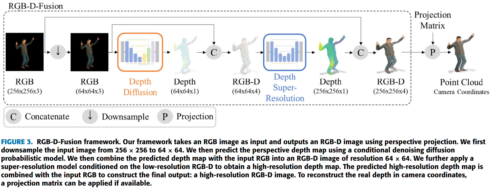
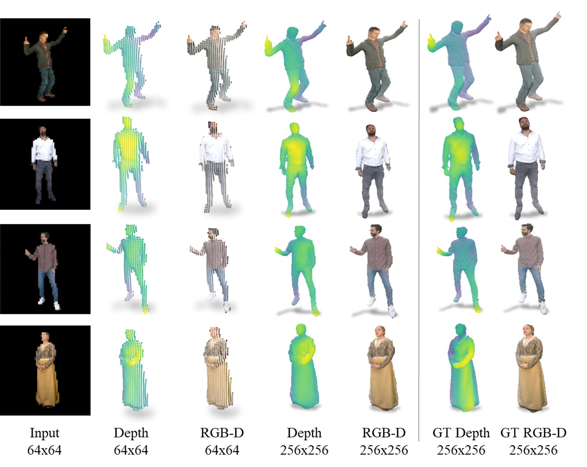
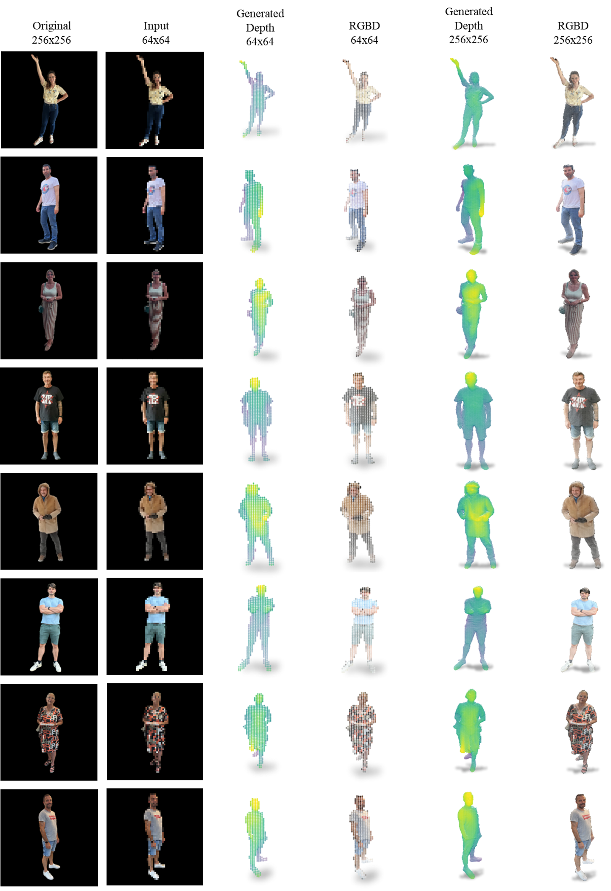
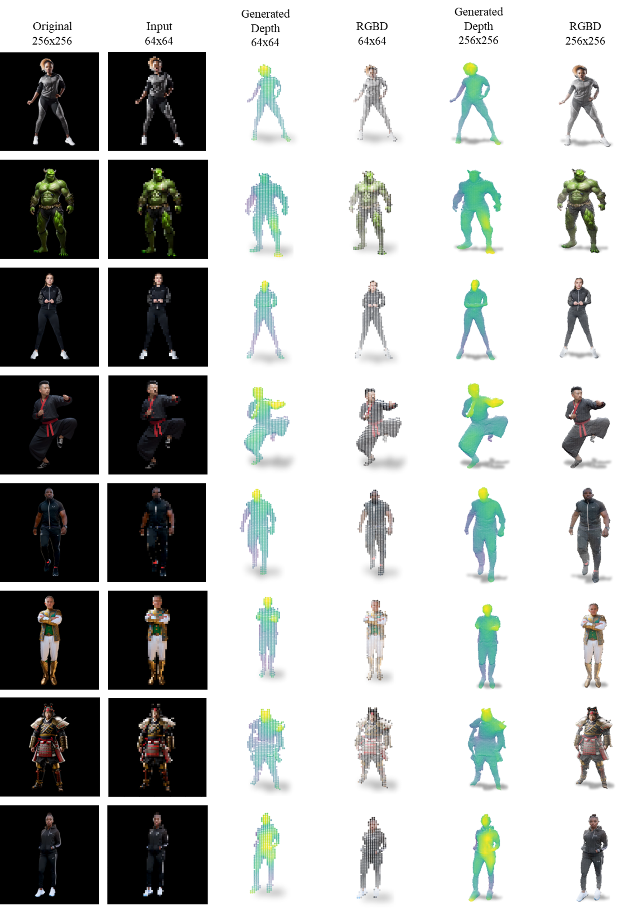

# :rainbow: RGB-D-Fusion: Image Conditioned Depth Diffusion of Humanoid Subjects

**Authors:** <br>
[Sascha Kirch](https://sascha-kirch.github.io/), [Valeria Olyunina](https://orcid.org/0009-0000-9766-5057), [Jan Ondřej](https://orcid.org/0000-0002-5409-1521), [Rafael Pagés](https://orcid.org/0000-0002-5691-9580), [Sergio Martín](https://orcid.org/0000-0002-4118-0234) & [Clara Pérez-Molina](https://orcid.org/0000-0001-8260-4155)

[[`Paper`](https://ieeexplore.ieee.org/document/10239167)] [[`BibTex`](#black_nib-citation)]

TensorFlow implementation for RGB-D-Fusion. For details, see the paper **[RGB-D-Fusion: Image Conditioned Depth Diffusion of Humanoid Subjects](https://ieeexplore.ieee.org/document/10239167)**.

## :bulb: Contribution
- We provide a framework for high resolution **dense monocular depth estimation using diffusion models**.
- We perform **super-resolution for dense depth data** conditioned on a multi-modal RGB-D input condition using diffusion models.
- We introduce a **novel augmentation technique**, namely depth noise, to enhance the robustness of the depth super-resolution model.
- We perform **rigorous ablations and experiments** to validate our design choices

## :fire: News
- **`2023/10/14`**: Code is available Now!
- **`2023/09/04`**: Our [paper](https://ieeexplore.ieee.org/document/10239167) is now published in IEEE Access!
- **`2023/07/29`**: We release our [pre-print](https://arxiv.org/abs/2307.15988) on arxiv.

## :star: Framework


## :medal_military: Results

### Prediction vs. GT


### In the wild predictions
<table>
  <tr>
    <td> </td>
    <td></td>
    <td></td>
   </tr> 
</table>

## :hammer_and_wrench: Installation
We reccomend using a docker environment. We provide a [docker file from TensorFlow](environment/depth-diffusion-gpu-tensorflow.Dockerfile) and a [docker file from nvidia](environment/nvidia-tf-2_10.Dockerfile). The later one is larger but includes nvidia's performance optimizations.
Ensure docker is installed including nvidia's GPU extension.

1. Build the image
```bash
docker build -t <IMAGE_NAME>/<VERSION> -f <PATH_TO_DOCKERFILE>
```
2. Create the container
```bash
docker container create --gpus all -u 1000:1000 --name rgb-d-fusion -p 8888:8888 -v <PATH_TO_tf_DIR>:/tf -v <PATH_TO_YOUR_GIT_DIR>:/tf/GitHub -it <IMAGE_NAME>/<VERSION>
```
3. Start the container
```bash
docker start rgb-d-fusion
```

The directory hierachy should look as follows
```
|- tf
   |- manual_datasets
      |- <DATASET 1> 
         |- test
            |- DEPTH_RENDER_EXR
            |- MASK
            |- PARAM
            |- RENDER
         |- train                     # same hierachy as in test
      |- <DATASET 2>                   # same hierachy as inv_humas_rendered
   |- GitHub
      |- ConditionalDepthDiffusion    # This Repo
   |- output_runs                     # Auto generated directory to store results
      |- DepthDiffusion
         |- checkpoints               # stores saved model checkpoints
         |- illustrations             # illustrations that are beeing generated during or after training
         |- diffusion_output          # used for inference to store data sampled from the model
      |- SuperResolution              # same hierachy as in DepthDiffusion
```
The hierachy might be created in one place or in different directories. When starting the docker container, different directories can be mounted together.

### Run Training, Evaluation and/or Inference scripts
Scripts are located under [scripts](scripts/).
Currently there are two types of models:
1. **Depth Diffusion Model**, a diffusion model that generates a depth map conditioned on an RGB image
2. **Superresolution Diffusion Model**, a diffusion model that generates high resolution RGB-D from low resolution RGB-D.

Each model has it's dedicated training, eval and inference scripts written in python. You can check the functionality and parameters via ```python <SCRIPT> -h```.

## :black_nib: Citation

If you find our work helpful for your research, please consider citing the following BibTeX entry.

```bibtex
@article{kirch_rgb-d-fusion_2023,
 title = {RGB-D-Fusion: Image Conditioned Depth Diffusion of Humanoid Subjects},
 author = {Kirch, Sascha and Olyunina, Valeria and Ondřej, Jan and Pagés, Rafael and Martín, Sergio and Pérez-Molina, Clara},
 journal = {IEEE Access},
 year = {2023},
 volume = {11},
 issn = {2169-3536},
 doi = {10.1109/ACCESS.2023.3312017},
 pages = {99111--99129},
 url = {https://ieeexplore.ieee.org/document/10239167},
}

```
